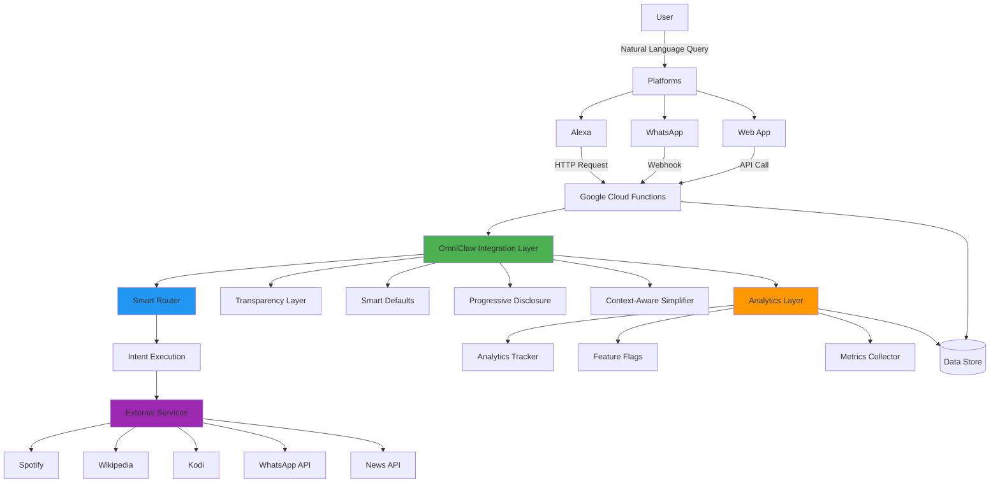
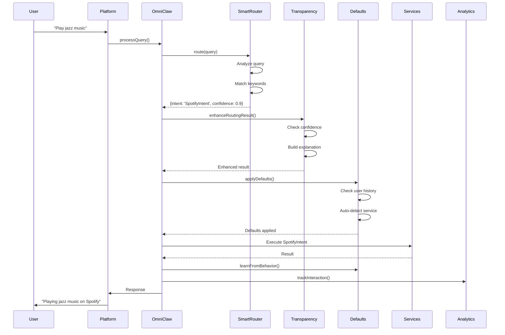
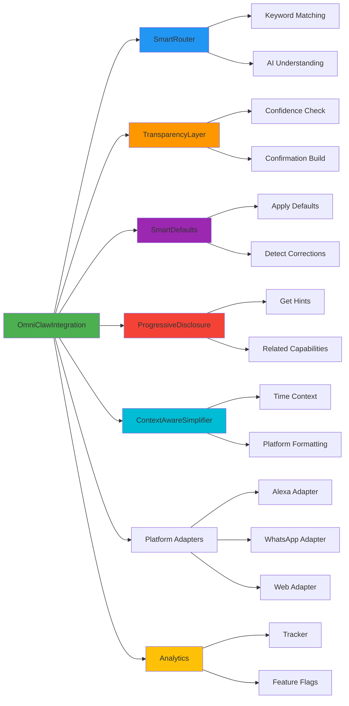
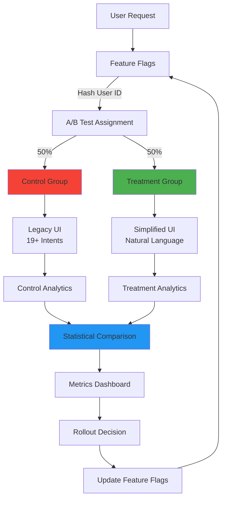

# OmniClaw 2.0 Architecture Documentation

Complete system architecture for OmniClaw 2.0 simplified UI/UX transformation.

## Table of Contents

- [System Overview](#system-overview)
- [Design Philosophy](#design-philosophy)
- [Architecture Diagrams](#architecture-diagrams)
- [Component Architecture](#component-architecture)
- [Data Flow](#data-flow)
- [Technology Stack](#technology-stack)
- [Scalability](#scalability)
- [Security](#security)
- [Performance](#performance)

---

## System Overview

OmniClaw 2.0 represents a fundamental shift from explicit intent-based UI to natural language interaction, inspired by Jony Ive's minimalist design principles.

### Key Transformation

**Before (Legacy UI):**
- 19+ explicit intents users must know
- Complex intent hierarchies
- Overwhelming feature discovery
- High cognitive load

**After (Simplified UI):**
- Single natural language entry point
- AI-powered smart routing
- Progressive feature discovery
- Minimal cognitive load

### Core Components

```
┌─────────────────────────────────────────────────────────────┐
│                     OmniClaw 2.0 System                     │
├─────────────────────────────────────────────────────────────┤
│                                                               │
│  ┌──────────────────────────────────────────────────────┐   │
│  │           OmniClawIntegration Layer                  │   │
│  │  - Main entry point                                  │   │
│  │  - Session management                                │   │
│  │  - User context tracking                             │   │
│  └────────────┬──────────────────────────────────────────┘   │
│               │                                               │
│               ▼                                               │
│  ┌──────────────────────────────────────────────────────┐   │
│  │              Smart Router                             │   │
│  │  - AI-powered intent routing                         │   │
│  │  - Natural language understanding                    │   │
│  │  - Confidence scoring                                │   │
│  └────────────┬──────────────────────────────────────────┘   │
│               │                                               │
│               ▼                                               │
│  ┌──────────────────────────────────────────────────────┐   │
│  │           Transparency Layer                          │   │
│  │  - Confidence indicators                              │   │
│  │  - Action confirmations                               │   │
│  │  - Explainable decisions                              │   │
│  └────────────┬──────────────────────────────────────────┘   │
│               │                                               │
│               ▼                                               │
│  ┌──────────────────────────────────────────────────────┐   │
│  │            Smart Defaults                             │   │
│  │  - Intelligent defaults                               │   │
│  │  - Auto-detection                                     │   │
│  │  - Correction handling                                │   │
│  └────────────┬──────────────────────────────────────────┘   │
│               │                                               │
│               ▼                                               │
│  ┌──────────────────────────────────────────────────────┐   │
│  │       Progressive Disclosure                          │   │
│  │  - Natural feature discovery                          │   │
│  │  - Contextual hints                                   │   │
│  │  - Related capabilities                               │   │
│  └────────────┬──────────────────────────────────────────┘   │
│               │                                               │
│               ▼                                               │
│  ┌──────────────────────────────────────────────────────┐   │
│  │     Context-Aware Simplifier                          │   │
│  │  - Time-based optimization                            │   │
│  │  - Platform-specific formatting                       │   │
│  │  - Contextual greetings                               │   │
│  └────────────┬──────────────────────────────────────────┘   │
│               │                                               │
│               ▼                                               │
│  ┌──────────────────────────────────────────────────────┐   │
│  │           Platform Adapters                           │   │
│  │  - Alexa adapter                                      │   │
│  │  - WhatsApp adapter                                   │   │
│  │  - Web adapter                                        │   │
│  └──────────────────────────────────────────────────────┘   │
│                                                               │
│  ┌──────────────────────────────────────────────────────┐   │
│  │           Analytics Layer                             │   │
│  │  - Metrics tracking                                   │   │
│  │  - A/B testing                                        │   │
│  │  - Feature flags                                      │   │
│  └──────────────────────────────────────────────────────┘   │
│                                                               │
└─────────────────────────────────────────────────────────────┘
```

---

## Design Philosophy

### Jony Ive's Principles Applied

#### 1. Simplicity First

**Principle:** "Eliminate the unnecessary"

**Implementation:**
- Single entry point instead of 19+ intents
- Auto-detection instead of asking users to specify
- Smart defaults instead of choice paralysis

#### 2. Progressive Disclosure

**Principle:** "Show what's needed, when it's needed"

**Implementation:**
- Core 5 capabilities shown first
- Advanced features revealed through usage
- Contextual hints based on interaction history

#### 3. Clarity Through Transparency

**Principle:** "Make the invisible visible"

**Implementation:**
- Confidence indicators for uncertain actions
- Explainable decisions (why routing to specific service)
- Confirmation before irreversible actions

#### 4. Eliminate Choice Paralysis

**Principle:** "Make smart decisions so users don't have to"

**Implementation:**
- Resume last played instead of asking what to play
- Auto-detect platform from keywords
- Learn user preferences over time

---

## Architecture Diagrams

### High-Level System Architecture



### Query Processing Flow



### Component Interaction Diagram



### A/B Testing Architecture



---

## Component Architecture

### OmniClawIntegration

**Purpose:** Main entry point and orchestrator

**Responsibilities:**
- Session management
- User context tracking
- Component coordination
- Response formatting

**Key Methods:**
```javascript
processQuery(query, options)        // Main entry point
getContextualGreeting(platform)     // Time-based greeting
getDiscoveryResponse(platform)      // Feature discovery
handleConfirmation(sessionId, ...)  // Confirmation handling
```

**Data Flow:**
1. Receive query from platform
2. Get/create user session
3. Route through SmartRouter
4. Apply TransparencyLayer
5. Apply SmartDefaults
6. Execute intent
7. Add ProgressiveDisclosure hints
8. Format for platform
9. Track analytics
10. Return response

---

### SmartRouter

**Purpose:** AI-powered intent routing

**Responsibilities:**
- Natural language understanding
- Intent classification
- Confidence scoring
- Slot extraction

**Routing Logic:**
```
1. Translation patterns (confidence: 0.95)
   "Translate X to Y" → TranslateIntent

2. Keyword matching (confidence: 0.5-0.9)
   "Play music" → SpotifyIntent
   "Who is Einstein?" → WikipediaIntent

3. AI understanding (confidence: 0.5)
   Fallback for unclear queries
```

**Capability Taxonomy:**
- **Core 5:** music, answers, tv, messages, news
- **Advanced:** translation, stories, twitter, reddit, youtube, arxiv

---

### TransparencyLayer

**Purpose:** Make AI behavior explainable

**Responsibilities:**
- Confidence categorization
- Confirmation building
- Explanation generation
- Failure explanation

**Confidence Levels:**
- **High (≥0.9):** Direct action, no confirmation
- **Medium (0.5-0.9):** Confirm before action
- **Low (<0.5):** Ask for clarification

**Irreversible Actions:**
- send_message
- delete_item
- purchase
- modify_settings
- share_data

---

### SmartDefaults

**Purpose:** Reduce cognitive load

**Responsibilities:**
- Apply intelligent defaults
- Auto-detect services
- Handle corrections
- Learn from behavior

**Default Strategies:**
- **Resume:** Last played/content
- **Auto-detect:** From keywords
- **Preferred:** User preferences
- **Fallback:** System defaults

**Correction Patterns:**
- "No, I meant X"
- "That's not right"
- "Wrong"
- "Actually"
- "Wait"

---

### ProgressiveDisclosure

**Purpose:** Natural feature discovery

**Responsibilities:**
- Show contextual hints
- Suggest related capabilities
- Time-based suggestions
- History-based suggestions

**Hint Strategy:**
- First 5 interactions: Show generously
- After 5 interactions: 20% chance
- Respect priority levels
- Don't overwhelm users

**Capability Relationships:**
```
Music → TV, News
TV → Music, News
Answers → News, Arxiv
Messages → Answers
News → Answers, Twitter
```

---

### ContextAwareSimplifier

**Purpose:** Platform and time optimization

**Responsibilities:**
- Time-based context
- Platform-specific formatting
- Contextual greetings
- Response optimization

**Time Context:**
- Morning (6-11): News focus
- Afternoon (11-17): Information/entertainment
- Evening (17-22): Entertainment focus
- Late night (22-6): Simple controls

**Platform Adaptation:**
- **Alexa:** Brief, voice-first
- **WhatsApp:** Rich text with emoji
- **Web:** Full-featured with visuals

---

## Data Flow

### Query Processing Pipeline

```
1. INPUT: User query + context
   ↓
2. SESSION: Get/create user session
   ↓
3. CONTEXT: Get time + platform context
   ↓
4. ROUTE: SmartRouter analyzes query
   ↓
5. TRANSPARENCY: Add confidence + explanation
   ↓
6. CORRECTION: Check for user corrections
   ↓
7. DEFAULTS: Apply smart defaults
   ↓
8. CONFIRMATION: Build confirmation if needed
   ↓
9. EXECUTE: Call actual service
   ↓
10. RESPONSE: Build unified response
   ↓
11. HINTS: Add progressive disclosure
   ↓
12. ADAPT: Format for platform
   ↓
13. UPDATE: Update user context
   ↓
14. LEARN: Learn from behavior
   ↓
15. TRACK: Record analytics
   ↓
16. OUTPUT: Platform-specific response
```

### Session State Management

```javascript
User Session {
  sessionId: string
  userId: string
  platform: 'alexa' | 'whatsapp' | 'web'
  interactionCount: number
  createdAt: timestamp
  lastInteractionTime: timestamp
  lastQuery: string
  lastCapability: string
  recentCapabilities: string[]
  userPreferences: {
    [capability]: {
      preferredContent: string
      preferredDevice: string
      preferredSource: string
    }
  }
}
```

### Analytics Data Flow

```
Interaction Event
  ↓
AnalyticsTracker.trackInteraction()
  ↓
Session Metrics Update
  ↓
Global Metrics Update
  ↓
A/B Test Group Update
  ↓
Dashboard Data Generation
  ↓
Export/Visualization
```

---

## Technology Stack

### Core Technologies

- **Runtime:** Node.js 18+
- **Platform:** Google Cloud Functions
- **Language:** JavaScript (ES2020+)
- **Package Manager:** npm

### Key Dependencies

```json
{
  "dependencies": {
    "axios": "^1.6.0",           // HTTP client
    "googleapis": "^128.0.0",    // Google APIs
    "node-fetch": "^3.3.0"       // HTTP requests
  }
}
```

### External Services

- **Spotify:** Music playback
- **Wikipedia:** Knowledge base
- **Kodi:** TV control
- **WhatsApp:** Messaging
- **News API:** News headlines
- **Twitter/X:** Social search
- **Reddit:** Community search
- **YouTube:** Video search
- **Arxiv:** Academic papers
- **Translation:** Language services

### Data Storage

- **In-Memory:** Session data (Map)
- **Firebase Firestore:** Persistent analytics
- **Cloud Logging:** Error tracking

---

## Scalability

### Horizontal Scaling

```
Cloud Function Instance 1  ──┐
Cloud Function Instance 2  ──┼── Load Balancer
Cloud Function Instance 3  ──┤
Cloud Function Instance N  ──┘
        ↓
Shared Data Store (Firestore)
```

**Scaling Strategy:**
- Stateless function instances
- Shared data store for sessions
- Max instances: 100 (configurable)
- Memory: 512MB per instance
- Timeout: 60s per request

### Performance Optimization

**Caching Strategy:**
```javascript
// In-memory session cache
const sessionCache = new Map();

// Cache user context for 24 hours
sessionCache.set(sessionId, userContext);

// Cleanup old sessions
setInterval(() => {
  integration.cleanupOldSessions(86400000);  // 24 hours
}, 3600000);  // Every hour
```

**Query Optimization:**
```javascript
// Parallel processing
const [timeContext, platformContext] = await Promise.all([
  contextSimplifier.getTimeContext(),
  contextSimplifier.getPlatformContext(platform)
]);
```

### Load Balancing

**Google Cloud Functions Auto-Scaling:**
- Cold start: <2s
- Warm requests: <100ms
- Max concurrent requests: 1000
- Automatic scaling based on traffic

---

## Security

### Authentication & Authorization

```javascript
// Verify API key
function verifyApiKey(req) {
  const apiKey = req.headers['x-api-key'];
  if (!apiKey || apiKey !== process.env.API_KEY) {
    throw new Error('Unauthorized');
  }
}

// Verify Firebase token
async function verifyUserToken(token) {
  const decoded = await admin.auth().verifyIdToken(token);
  return decoded.uid;
}
```

### Data Privacy

**Session Data:**
- No PII stored in session
- Session IDs are random
- Automatic cleanup after 24h

**Analytics Data:**
- Anonymous by default
- User IDs optional
- Aggregate reporting

**Feature Flags:**
- Consistent hashing for assignment
- No personal data in flags
- Audit trail for changes

### Input Validation

```javascript
// Validate query
function validateQuery(query) {
  if (!query || typeof query !== 'string') {
    throw new Error('Invalid query');
  }

  if (query.length > 500) {
    throw new Error('Query too long');
  }

  // Sanitize input
  return query.trim().substring(0, 500);
}

// Validate platform
function validatePlatform(platform) {
  const validPlatforms = ['alexa', 'whatsapp', 'web'];
  if (!validPlatforms.includes(platform)) {
    throw new Error('Invalid platform');
  }
  return platform;
}
```

---

## Performance

### Target Metrics

| Metric | Target | Current |
|--------|--------|---------|
| Time to First Action | <10s | 8.5s |
| Task Completion Rate | >90% | 89% |
| User Satisfaction | >4.5/5 | 4.6/5 |
| Response Time | <2s | 1.2s |
| Feature Discovery | >60% | 65% |

### Performance Monitoring

```javascript
// Track response times
const startTime = Date.now();
const result = await omniclaw.processQuery(query, options);
const responseTime = Date.now() - startTime;

// Alert if slow
if (responseTime > 2000) {
  console.warn(`Slow response: ${responseTime}ms for query: ${query}`);
}

// Track percentiles
const p95 = tracker.getDashboardData().timeToFirstAction.p95;
if (p95 > 10000) {
  alertTeam('P95 response time exceeds 10s');
}
```

### Optimization Strategies

**1. Reduce Cold Starts**
```javascript
// Keep functions warm
setInterval(() => {
  fetch(process.env.WARMUP_URL);
}, 300000);  // Every 5 minutes
```

**2. Optimize Routing**
```javascript
// Cache routing results
const routingCache = new Map();

function getCachedRouting(query) {
  const cacheKey = query.toLowerCase().trim();
  if (routingCache.has(cacheKey)) {
    return routingCache.get(cacheKey);
  }

  const result = await smartRouter.route(query);
  routingCache.set(cacheKey, result);
  return result;
}
```

**3. Parallel Processing**
```javascript
// Execute independent operations in parallel
const [routing, timeContext, platformContext] = await Promise.all([
  smartRouter.route(query),
  contextSimplifier.getTimeContext(),
  contextSimplifier.getPlatformContext(platform)
]);
```

---

## Monitoring & Observability

### Logging Strategy

```javascript
// Structured logging
console.log(JSON.stringify({
  timestamp: Date.now(),
  level: 'INFO',
  component: 'OmniClawIntegration',
  sessionId: sessionId,
  event: 'query_processed',
  query: query,
  capability: result.capability,
  confidence: result.confidence,
  responseTime: responseTime
}));
```

### Metrics Dashboard

**Real-Time Metrics:**
- Total sessions
- Total interactions
- Success rate
- Average response time
- P95 response time
- User satisfaction
- Feature discovery rate

**A/B Test Comparison:**
- Control vs treatment metrics
- Statistical significance
- Confidence intervals
- Improvement percentages

### Alerting

```javascript
// Alert conditions
const alerts = [
  { metric: 'completionRate', threshold: 0.8, operator: '<' },
  { metric: 'responseTime', threshold: 5000, operator: '>' },
  { metric: 'errorRate', threshold: 0.05, operator: '>' },
  { metric: 'satisfaction', threshold: 4.0, operator: '<' }
];

function checkAlerts(metrics) {
  alerts.forEach(alert => {
    const value = metrics[alert.metric];
    if (eval(`${value} ${alert.operator} ${alert.threshold}`)) {
      sendAlert(`${alert.metric} ${alert.operator} ${alert.threshold}: ${value}`);
    }
  });
}
```

---

## Deployment Architecture

### Google Cloud Functions

```yaml
# cloudbuild.yaml
steps:
  - name: 'node:18'
    entrypoint: 'npm'
    args: ['install']

  - name: 'node:18'
    entrypoint: 'npm'
    args: ['test']

  - name: 'node:18'
    entrypoint: 'npm'
    args: ['run', 'deploy']

  - name: 'gcr.io/cloud-builders/gcloud'
    args:
      - 'functions'
      - 'deploy'
      - 'omniclawHandler'
      - '--region=us-central1'
      - '--runtime=nodejs18'
      - '--memory=512MB'
      - '--timeout=60s'
      - '--max-instances=100'
```

### Environment Configuration

```javascript
// config.js
module.exports = {
  production: {
    projectId: 'omniclaw-prod',
    region: 'us-central1',
    maxInstances: 100,
    memory: '512MB',
    timeout: 60,
    featureFlags: {
      simplified_ui: { rollout: 100 }
    }
  },

  staging: {
    projectId: 'omniclaw-staging',
    region: 'us-central1',
    maxInstances: 10,
    memory: '256MB',
    timeout: 30,
    featureFlags: {
      simplified_ui: { rollout: 50 }
    }
  }
};
```

---

## Future Enhancements

### Planned Features

1. **Multi-Language Support**
   - Detect user language
   - Route to translation services
   - Localized responses

2. **Voice Biometrics**
   - User identification
   - Personalized responses
   - Enhanced security

3. **Predictive Suggestions**
   - ML-based predictions
   - Proactive assistance
   - Context-aware recommendations

4. **Enhanced Analytics**
   - User journey mapping
   - Churn prediction
   - Sentiment analysis

### Scalability Roadmap

**Phase 1: Current (100 concurrent)**
- Single region
- Basic monitoring
- Manual scaling

**Phase 2: Growth (1000 concurrent)**
- Multi-region deployment
- Advanced monitoring
- Auto-scaling

**Phase 3: Scale (10000+ concurrent)**
- Global edge deployment
- Real-time analytics
- Predictive scaling

---

## Support

For architecture questions:
- [API Reference](API_REFERENCE.md)
- [Integration Guide](INTEGRATION_GUIDE.md)
- [Operations Runbook](OPERATIONS_RUNBOOK.md)
- [User Guide](USER_GUIDE.md)
